```mermaid
sequenceDiagram
    participant Provider as Webhook (Stripe/PayPal)
    participant API
    participant Redis as Redis (Distributed Lock)
    participant DB as Postgres (ACID)

    Provider->>API: POST /webhook (Payment Event)
    
    rect rgb(20, 20, 20)
        note right of API: 1. Security (Zero Trust)
        API->>API: Validate HMAC-SHA256 (Signature)
        
        note right of API: 2. Distributed Lock
        API->>Redis: SET resource:id NX PX 10000
        Redis-->>API: OK (Lock Acquired)
        
        alt Lock Failed (Concurrency/Duplicate)
            API-->>Provider: 429/409 (Ignore/Retry Safe)
        else Lock Success
            note right of API: 3. ACID Deduplication
            API->>DB: BEGIN TRANSACTION
            API->>DB: SELECT * FROM payments WHERE id = evt_id
            
            alt Already Processed
                API->>DB: ROLLBACK
                API->>Redis: DEL resource:id
                API-->>Provider: 200 OK (Idempotent)
            else New Event
                API->>DB: INSERT INTO payments ...
                API->>DB: COMMIT
                API->>Redis: DEL resource:id
                API-->>Provider: 201 Created
            end
        end
    end
```

# Resilient Payment Processor


**[🇧🇷 Leia em Português](README.pt-br.md)**

Enterprise-Grade Payment Gateway designed to ensure **Zero Double-Spending** and **High Resilience** when processing Webhooks (Stripe, PayPal, etc.). Implements distributed architecture patterns to resolve Race Conditions under high load.

---

## 🔒 Resilience Flow



---

## 🏗 Why is this necessary?

Naive payment systems fail catastrophically when:
1.  **Provider Sends Duplicates:** Stripe/PayPal often send the same webhook multiple times (*at-least-once* guarantee). Without strict idempotency, you might credit a user twice.
2.  **Concurrent Requests:** Two requests arriving in the same millisecond can bypass a simple `if (!exists)` check if there is no Atomic Locking.

This project solves this with a **Defense in Depth** approach:
- **Redis Mutex:** Prevents immediate parallel processing.
- **Relational Database:** Ensures the Single Source of Truth via integrity constraints.

---

## 🚀 Key Features

### 1. Robust Idempotency
Combination of unique constraints in Postgres with distributed caching. Even if the cluster scales to 100 replicas, Redis ensures only one worker processes a specific event at a time.

### 2. Cryptographic Security (HMAC)
Nothing enters the system without a valid signature. The middleware calculates the SHA-256 hash of the raw payload (`Buffer`) and compares it with the provider's header in constant time (preventing *Timing Attacks*).

### 3. Fail-Safe
If the database goes down or Redis crashes, the system is designed to fail "closed" (reject the request) so the provider can retry later, ensuring no data is corrupted or partially lost.

---

## 🛠 Tech Stack

- **Runtime:** Node.js / TypeScript (Strict Mode)
- **Framework:** Fastify (Performance Focused)
- **Database:** PostgreSQL 15 + Prisma ORM
- **Cache/Lock:** Redis (ioredis with Lua scripts for atomicity)
- **Validation:** Zod (Schema Parsing)
- **Testing:** Jest (Integration Tests with Concurrency Simulation)

---

## ⚡ Quick Start

### 1. Start Infrastructure
Use Docker Compose to orchestrate Postgres and Redis locally.
```bash
docker-compose up -d
```

### 2. Configure Environment
```bash
cp .env.example .env
# Configure DATABASE_URL and REDIS_URL
```

### 3. Install and Migrate
```bash
npm install
npm run db:migrate
```

### 4. Run Concurrency Tests
This script fires 20 simultaneous requests with the same ID to prove system resilience.
```bash
npm run test:concurrency
```

---

## 👨‍💻 Author

**Gérson Resplandes**
Backend Engineer focused on Software Architecture and High Availability Systems.

[](https://www.linkedin.com/in/gerson-resplandes-de-s%C3%A1-sousa-999bb33a3/)
[](mailto:maiorgerson@gmail.com)
