# Resilient Payment Processor


**[🇺🇸 Read in English](README.md)**

Gateway de pagamentos Enterprise-Grade projetado para garantir **Zero Double-Spending** e **Alta Resiliência** no processamento de Webhooks (Stripe, PayPal, etc.). Implementa padrões de arquitetura distribuída para resolver condições de corrida (Race Conditions) sob carga elevada.

---

## 🔒 Fluxo de Resiliência

```mermaid
sequenceDiagram
    participant Provedor as Webhook (Stripe/PayPal)
    participant API
    participant Redis as Redis (Distributed Lock)
    participant DB as Postgres (ACID)

    Provedor->>API: POST /webhook (Evento de Pagamento)
    
    rect rgb(20, 20, 20)
        note right of API: 1. Segurança (Zero Trust)
        API->>API: Validação HMAC-SHA256 (Assinatura)
        
        note right of API: 2. Lock Distribuído
        API->>Redis: SET resource:id NX PX 10000
        Redis-->>API: OK (Lock Adquirido)
        
        alt Lock Falhou (Concorrência/Duplicata)
            API-->>Provedor: 429/409 (Ignorar/Retry Safe)
        else Lock Sucesso
            note right of API: 3. Deduplicação ACID
            API->>DB: BEGIN TRANSACTION
            API->>DB: SELECT * FROM payments WHERE id = evt_id
            
            alt Já Processado
                API->>DB: ROLLBACK
                API->>Redis: DEL resource:id
                API-->>Provedor: 200 OK (Idempotente)
            else Novo Evento
                API->>DB: INSERT INTO payments ...
                API->>DB: COMMIT
                API->>Redis: DEL resource:id
                API-->>Provedor: 201 Created
            end
        end
    end
```



---

## 🏗 Por que isso é necessário?

Sistemas de pagamento ingênuos falham catastroficamente quando:
1.  **O Provedor Envia Duplicatas:** O Stripe/PayPal frequentemente envia o mesmo webhook múltiplas vezes (garantia *at-least-once*). Sem idempotência estrita, você credita o usuário duas vezes.
2.  **Requisições Concorrentes:** Duas requisições chegando no mesmo milissegundo podem passar pela verificação `if (!exists)` simultaneamente se não houver Travamento Atômico (Locking).

Este projeto resolve isso com uma abordagem de **Defesa em Profundidade**:
- **Redis Mutex:** Impede processamento paralelo imediato.
- **Banco de Dados Relacional:** Garante a verdade única (Source of Truth) via restrições de integridade.

---

## 🚀 Funcionalidades Chave

### 1. Idempotência Robusta
Combinação de chaves únicas no Postgres com cache distribuído. Mesmo se o cluster escalar para 100 réplicas, o Redis garante que apenas um worker processe um evento específico por vez.

### 2. Segurança Criptográfica (HMAC)
Nada entra no sistema sem uma assinatura válida. O middleware calcula o hash SHA-256 do payload bruto (`Buffer`) e compara com o header enviado pelo provedor em tempo constante (prevenindo *Timing Attacks*).

### 3. Falha Segura (Fail-Safe)
Se o banco de dados cair ou o Redis travar, o sistema é projetado para falhar "fechado" (rejeitar a requisição) para que o provedor tente novamente mais tarde, garantindo que nenhum dado seja corrompido ou perdido parcialmente.

---

## 🛠 Tech Stack

- **Runtime:** Node.js / TypeScript (Strict Mode)
- **Framework:** Fastify (Performance Focada)
- **Banco de Dados:** PostgreSQL 15 + Prisma ORM
- **Cache/Lock:** Redis (ioredis com scripts Lua para atomicidade)
- **Validação:** Zod (Parseamento de Schema)
- **Testes:** Jest (Testes de Integração com Simulação de Concorrência)

---

## ⚡ Guia Rápido

### 1. Subir Infraestrutura
Usa Docker Compose para orquestrar Postgres e Redis localmente.
```bash
docker-compose up -d
```

### 2. Configurar Variáveis
```bash
cp .env.example .env
# Configure DATABASE_URL e REDIS_URL
```

### 3. Instalar e Migrar
```bash
npm install
npm run db:migrate
```

### 4. Rodar Testes de Concorrência
Este script dispara 20 requisições simultâneas com o mesmo ID para provar a resiliência do sistema.
```bash
npm run test:concurrency
```

---

## 👨‍💻 Autor

**Gérson Resplandes**
Engenheiro Backend focado em Arquitetura de Software e Sistemas de Alta Disponibilidade.

[](https://www.linkedin.com/in/gerson-resplandes-de-s%C3%A1-sousa-999bb33a3/)
[](mailto:maiorgerson@gmail.com)
